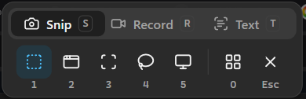
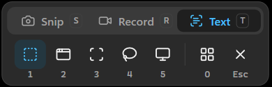
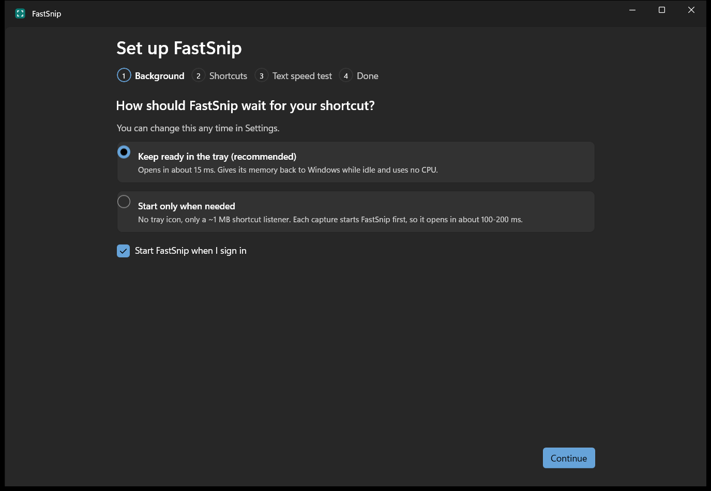
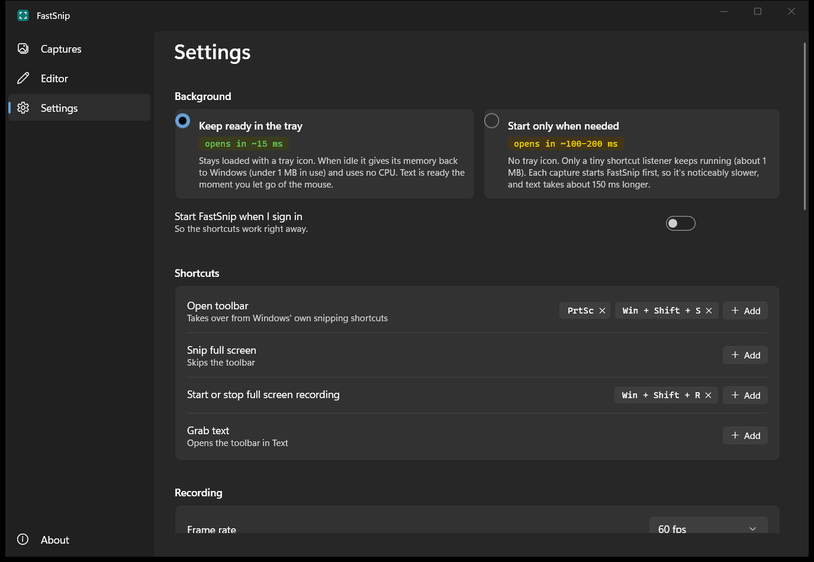
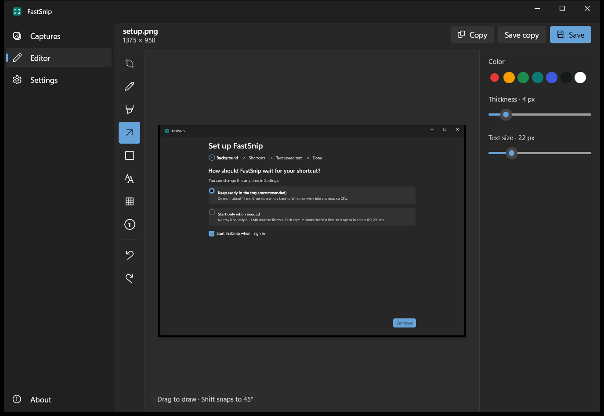

<p align="center">
  
</p>

<h1 align="center">FastSnip</h1>

<p align="center">
  A fast screenshot, screen recording and text-grabbing tool for Windows.<br>
  Press <kbd>PrtSc</kbd> and the screen freezes in about 10 ms, with the toolbar ready at the top.
</p>

<p align="center">
  
</p>

---

## What it does

- **Screenshots** in five shapes: rectangle, window, element (a button or panel under the mouse), freeform and full screen. Every screenshot is **copied to the clipboard and saved** to `Pictures\Screenshots` straight away.
- **Text mode** works like Live Text on iPhone. The text on screen becomes selectable where it is, you drag across the words you want, and only then copy them. Nothing goes to the clipboard until you copy.
- **Screen recording** of an area, a window or a whole display (or all displays), with system audio and your microphone. It uses your graphics card's encoder (MP4, H.264), and recordings are saved to `Videos\Screen Recordings` when you stop.
- **The toolbar never shows up in your shots.** The screen is frozen first and the shot is cut from that frozen image. While recording, the recording controls and the red frame are hidden from the capture.
- **An editor** for crop, pen, highlighter, arrow, box, text, blur and step numbers, and a trim bar for recordings. It opens only when you ask for it, from the small toast after a capture or from the gallery.
- **A captures gallery** that can search your screenshots by the words inside them.
- **Settings** for the shortcuts (fully changeable), accent color, light or dark theme, the popup animation and its speed, recording quality, and more.

Everything happens on your PC. Nothing is uploaded anywhere.

## Install

You get one zip from the [Releases page](../../releases). It holds four files:

| File | What it is |
|---|---|
| `FastSnip.msix` | The app itself (everything it needs is inside: nothing else to install) |
| `FastSnip.cer` | The certificate the app is signed with |
| `Install FastSnip.cmd` | **Double-click this one** |
| `install.ps1` | What the `.cmd` runs (you don't need to open it) |

### Steps

1. Download `FastSnip-<version>.zip` from [Releases](../../releases).
2. Right-click the zip, choose **Extract All…**, then **Extract**.
3. In the extracted folder, double-click **`Install FastSnip.cmd`**.

### What you'll see

1. **Maybe: "Do you want to run this file?"**
   Windows asks this for files that came from the internet. Click **Run**.

2. **A black console window** that says
   *"Trusting the FastSnip test certificate (CN=Hasthi J). Windows will ask for admin once."*
   Leave it open. It's the installer.

3. **A User Account Control prompt**: *"Do you want to allow this app to make changes to your device?"*, with **Windows PowerShell** and **Verified publisher: Microsoft Windows**.
   Click **Yes**. (A second console window may flash open for a moment. That's the one-line step that trusts the certificate.)

4. **Back in the black window**: *"Installing FastSnip..."* with a progress bar, then
   *"Installed FastSnip 0.1.2.0. Starting it..."*. The window closes.

5. **FastSnip opens** on its first-run setup (shown below). Pick your options, press **Start using FastSnip**, and you're done.

From then on, press <kbd>PrtSc</kbd> or <kbd>Win</kbd> <kbd>Shift</kbd> <kbd>S</kbd> anywhere.

> **Updates:** after this first install, just double-click a newer `FastSnip.msix` and click **Update**. The extra steps above are only needed once per PC.

### Why is there a `.cmd` instead of just the `.msix`?

Windows only installs an MSIX by double-click if it's signed with a certificate from a company Windows already trusts. Those certificates either cost money or need an identity check. FastSnip is free and open source, so for now each release is signed with **my own certificate (Hasthi J)**, which Windows doesn't know yet.

If you double-click `FastSnip.msix` before trusting it, Windows shows *"This app package's publisher certificate could not be verified"* (0x800B010A) and the Install button stays grey. That's expected.

`Install FastSnip.cmd` fixes that once:

- **It adds `FastSnip.cer` to "Trusted People" on your PC.** That store only tells Windows to accept app packages signed by Hasthi J. It doesn't make that certificate trusted for websites, drivers or anything else. That one step is why it asks for admin.
- **It installs `FastSnip.msix` for your account only.**
- **It removes an older FastSnip test build first**, if you had one signed under a different name.

The script is short and readable: open [`packaging/install.ps1`](packaging/install.ps1) to see exactly what it does.

When FastSnip is in the **Microsoft Store**, none of this is needed: you'll click Install and that's it.

### Uninstall

**Settings › Apps › Installed apps › FastSnip › Uninstall.**

To also remove the certificate: press <kbd>Win</kbd> <kbd>R</kbd>, type `certlm.msc`, open **Trusted People › Certificates**, and delete **Hasthi J**.

## Using it

### Shortcuts

| Keys | What happens |
|---|---|
| <kbd>PrtSc</kbd> or <kbd>Win</kbd> <kbd>Shift</kbd> <kbd>S</kbd> | Freeze the screen and open the toolbar |
| <kbd>Win</kbd> <kbd>Shift</kbd> <kbd>R</kbd> | Start or stop a full screen recording |

All of them can be changed (and more added) in **Settings › Shortcuts**.

> If <kbd>PrtSc</kbd> still opens Windows' own Snipping Tool, turn off **Settings › Accessibility › Keyboard › "Use the Print screen key to open screen capture"**. FastSnip's setup shows a button that takes you there.

### On the toolbar

| Keys | What happens |
|---|---|
| <kbd>S</kbd> <kbd>R</kbd> <kbd>T</kbd> | Snip, Record, Text |
| <kbd>1</kbd> to <kbd>5</kbd> | Rectangle, window, element, freeform, full screen |
| <kbd>Enter</kbd> | Take the whole display (or start the recording) |
| <kbd>Tab</kbd> | In full screen: next display, then all displays |
| Arrow keys | Move the cursor by 1 px (<kbd>Shift</kbd> for 10 px) |
| <kbd>C</kbd> | Copy the color under the magnifier |
| <kbd>O</kbd> | Open the FastSnip window |
| <kbd>Esc</kbd> or right-click | Cancel |

### Text mode

<p></p>

Pick **Text** (or press <kbd>T</kbd>), then draw a box around some text. The words get highlighted where they are. Then:

- drag across words to select them (across lines too, like normal text)
- double-click a word, triple-click a line, or press <kbd>Ctrl</kbd> <kbd>A</kbd> for everything
- press <kbd>Ctrl</kbd> <kbd>C</kbd> or **Copy** on the little bar. **Open link**, **Email** and **Search** appear there when they make sense.

The text is read the moment the screen freezes, so it's usually ready before you finish drawing the box.

### Recording

Pick **Record**, choose an area (or a window, or full screen), then press <kbd>Enter</kbd> or **Start recording**. A short countdown runs, then a small pill shows the time with **mic**, **pause** and **stop** buttons. Neither the pill nor the red frame appears in the video. The video is saved to `Videos\Screen Recordings` when you stop.

### Background mode

In **Settings › Background**:

- **Keep ready in the tray (default):** opens in about 15 ms. When idle it gives its memory back to Windows (under 1 MB in use) and uses no CPU.
- **Start only when needed:** no tray icon, only a tiny shortcut listener (~1 MB). Each capture starts FastSnip first, so it takes about 100–200 ms.

**Quit** (tray menu, or **About › Quit FastSnip**) stops everything: the shortcuts, the tray icon and the window.

## Screenshots

**First-run setup**



**Settings**



**Editor**



## Build it yourself

You need:

- [Rust](https://rustup.rs)
- the [.NET 10 SDK](https://dotnet.microsoft.com/download)
- Visual Studio Build Tools with the Windows 10/11 SDK

Then:

```powershell
# the core (shortcuts, overlay, capture, recording)
cd core; cargo build --release

# the app window (gallery, editor, settings)
cd ..\app\FastSnip.App; dotnet build -c Release -p:Platform=x64

# the signed MSIX + installer files in out\release
cd ..\..; powershell -ExecutionPolicy Bypass -File .\packaging\build.ps1 -Version 0.1.2.0
```

`build.ps1 -Store -IdentityName … -Publisher …` makes the `.msixupload` for the Microsoft Store instead.

### How it's put together

- **`core/` (Rust).** `fastsnip.exe`: the keyboard hook, the screen freeze (DXGI Desktop Duplication, kept on the GPU), the Direct2D overlay and toolbar, text recognition (Windows.Media.Ocr), recording (Media Foundation, hardware H.264 + AAC), the tray icon and the toast. It's a single ~750 KB exe with no dependencies.
- **`app/` (C#, WinUI 3).** `FastSnip.App.exe`: the gallery, editor (Win2D), settings and setup. It only runs while its window is open.
- **`packaging/`.** The MSIX build and install scripts.
- **`docs/design/`.** The interactive design spec the UI was built from.

## License

[GNU GPL v3](LICENSE). Icons from [Lucide](https://lucide.dev) (ISC).

Made by **Hasthi J**.
